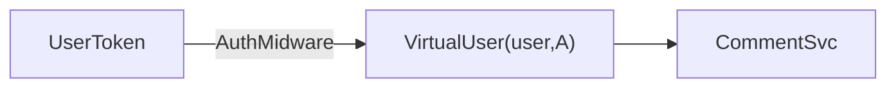
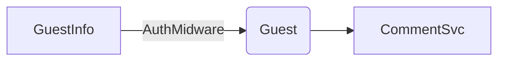
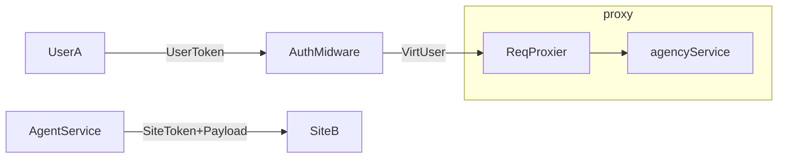
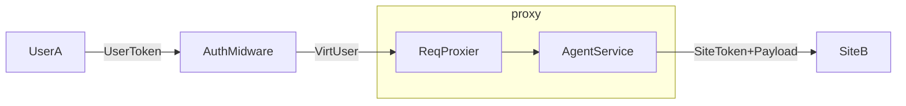

# 代理

## 背景

设本地站点 SiteA、本站用户 UserA、本站未登录访客 GuestA、本站文章 PostA。远程站点 SiteB、用户 UserB、未登录访客 GuestB、文章 PostB。考虑以下情形：

1. UserA 在 SiteA 上发表了对 PostA 的评论。
2. GuestA 在 SiteA 上发表了对 PostA 的评论。
3. UserA 在 SiteA 上发表了对 PostB 的评论。
4. GuestA 在 SiteA 上发表了对 PostB 的评论。

以上行为通过 `/comment/createComment` 过程调用接口实现。我们逐个考虑其实现。

1. UserA 在 SiteA 上发表了对 PostA 的评论。

    此情况下，SiteA 服务器提取 UserA 的信息，并调用 CommentService 创建评论，将评论关联到具体的用户。

2. GuestA 在 SiteA 上发表了对 PostA 的评论。

    此情况下，SiteA 服务器提取 GuestA 的信息，并调用 CommentService 创建评论，并标记为访客评论。

3. UserA 在 SiteA 上发表了对 PostB 的评论。

    此情况下，SiteA 从提取 UserA 信息，然后通过调用 AgentService 向远程的 SiteB 发出/comment/createComment 请求。为了验证请求的合法性，SiteB 需要由 SiteA 提供的签名令牌，并且为了创建评论，SiteB 还需要 UserA 的信息。尽管 UserA 不在 SiteB 的本地数据库中，但 SiteB 信任 UserA 的身份，因此会将评论标记为用户评论，但不会与具体用户关联。

4. GuestA 在 SiteA 上发表了对 PostB 的评论。

    此情况类似上一种，但是 SiteB 会将评论标记为访客评论，并且并不信任 GuestA 的身份。

上述情况看起来略显复杂，如按字面逻辑实现，则需要所有接口都判断当前登录的是哪种类型用户，判断是否需要远程执行，逻辑较为复杂，因此最好能将逻辑前置到 PreHandler，因此简单地按照如下方式处理：

1. 看是否传入了 `X-Vivlog-Token` 标头，若是，则尝试解析出用户或站点信息。
2. 看是否传入了 `X-Vivlog-Target-Site` 标头，且此 Site 非本站。若是，则代理到远程站点。
3. 看是否传入了 `X-Vivlog-Guest` 标头，若是，则尝试解析出访客信息。并且根据 Guest 中的 Trusted 字段，判断是否是可信访客。（例如来自 SiteA 的正规用户在 SiteA 上的 PostB 发表的评论，代理到 SiteB 时，会被视作可信访客）

相关中间件如下：

1. `verifySource`: 用于验证请求来源的身份，包括本站用户、站点。

    - 输入：`X-Vivlog-Token` 标头或 `Authorization` 标头
    - 输出：`req.source = { sub, type }`

2. `inflateAgent`: 用于通过 `req.source` 获取当前用户并设置 `req.agent`。

    - 输入：`req.source`
    - 输出：`req.agent = { type, role, id, local ... }`

3. `verifyTarget`: 用于验证请求目标的身份，包括本站用户、站点。

    - 输入：`X-Vivlog-Target-Site` 标头
    - 输出：无。若验证失败，则抛出异常，以免用户利用本站将请求代理到未知站点。

3. `proxyRequest`: 用于代理请求到远程站点。

    - 输入：`X-Vivlog-Target-Site` 标头
    - 输出：无。若验证失败，则抛出异常，以免用户利用本站将请求代理到未知站点。

再考虑上述情况：


1. UserA 在 SiteA 上发表了对 PostA 的评论。则 `req.agent = userA`，CommentService 将会关联评论到 UserA。
2. GuestA 在 SiteA 上发表了对 PostA 的评论。则 `req.agent = guestA`，CommentService 发现 `agent.trusted` 为 false，因此知道非本站用户评论。且根据 `agent.role` 为 Guest 将会标记评论为访客评论。
3. UserA 在 SiteA 上发表了对 PostB 的评论。则 `req.agent = userA`，AgentService 发现 `req.agent.local` 为 false，因此知道非本站用户评论，且根据 `agent.role` 为 User 将会标记评论为用户评论。
4. GuestA 在 SiteA 上发表了对 PostB 的评论。则 `req.agent = guestA`，AgentService 发现 `req.agent.local` 为 false，因此知道非本站用户评论，且根据 `agent.role` 为 Guest 将会标记评论为访客评论。

## 代理的类型

如下代码所示，代理的类型有三种：

- 访客（guest）：表示一个身份未经验证、也未在本地注册的用户。
  
  例如，一个访客在本地站点上发表了一条评论，这条评论将会被代理到远程站点上，而在远程站点上，这条评论将会被访问者（Virtual User）代表的访客发表。访问发表评论时，会附带访客的信息，例如访客的名称、电子邮件和网站。但这些信息是未经验证故而不可信的，因此将会标记为访客。

- 用户（user）：表示一个身份已经验证、并且在本地注册的用户。

  例如，一个用户在本地站点上发表了一条评论，这条评论将会被代理到远程站点上，而在远程站点上，这条评论将会被访问者（Virtual User）代表的用户发表。用户拥有比访客更多的信息和更高的可信度，用户的身份是收到本地站点承认的，而远程站点如果承认本地站点，则也承认了用户的身份。

- 系统（system）：表示一个站点。

  当一个请求代表本地站点，但不指代于具体的本地用户，则以系统的身份发出。系统的可信度和权限不低于用户。

```ts
export enum agencyType {
    guest = 'guest',
    user = 'user',
    system = 'system',
}

export type VirtualUserType = agencyType
```

## 访问者

访问者（Visitor）是指在远程站点（Site B）上的用户，它一个代表本地或远程站点的用户、访客或站点在远程站点上执行操作的实体。

实际上访问者的概念是代理概念的延伸，它是代理在远程站点上的具体表现，也是远程站点的用户、访客或站点在远程站点上执行操作的实体。

## 实例

当本站用户 UserA 在 SiteA 上发表对 PostA 的评论时，请求过程如下：



当匿名用户在 SiteA 上发表对 PostA 的评论时，由于匿名用户没有 Token，请求过程如下：



当本站用户 UserA 在 SiteA 上发表对远程文章 PostB 的评论时，请求过程如下：



当本站游客在 SiteA 上发表对远程文章 PostB 的评论时，请求过程如下：


