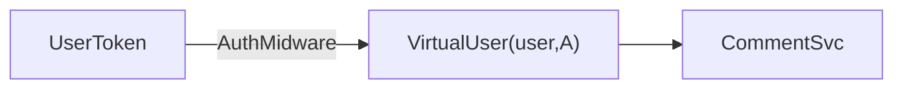
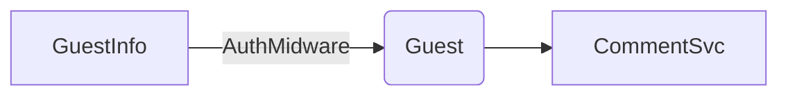
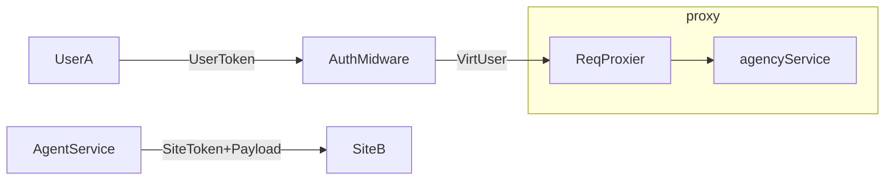
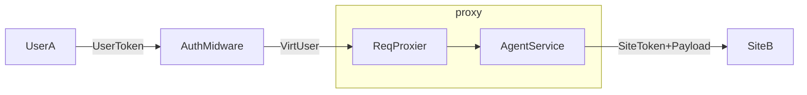

# 代理

## 背景

设本地站点 SiteA、本站用户 UserA、本站未登录访客 GuestA、本站文章 PostA。远程站点 SiteB、用户 UserB、未登录访客 GuestB、文章 PostB。考虑以下情形：

1. UserA 在 SiteA 上发表了对 PostA 的评论。
2. GuestA 在 SiteA 上发表了对 PostA 的评论。
3. UserA 在 SiteA 上发表了对 PostB 的评论。
4. GuestA 在 SiteA 上发表了对 PostB 的评论。

以上行为通过 `/comment/createComment` 过程调用接口实现。我们逐个考虑其实现。

1. UserA 在 SiteA 上发表了对 PostA 的评论。

    此情况下，SiteA 服务器提取 UserA 的信息，并调用 CommentService 创建评论，将评论关联到具体的用户。

2. GuestA 在 SiteA 上发表了对 PostA 的评论。

    此情况下，SiteA 服务器提取 GuestA 的信息，并调用 CommentService 创建评论，并标记为访客评论。

3. UserA 在 SiteA 上发表了对 PostB 的评论。

    此情况下，SiteA 从提取 UserA 信息，然后通过调用AgentService向远程的SiteB发出/comment/createComment请求。为了验证请求的合法性，SiteB需要由SiteA提供的签名令牌，并且为了创建评论，SiteB还需要UserA的信息。尽管UserA不在SiteB的本地数据库中，但SiteB信任UserA的身份，因此会将评论标记为用户评论，但不会与具体用户关联。

4. GuestA 在 SiteA 上发表了对 PostB 的评论。

    此情况类似上一种，但是SiteB会将评论标记为访客评论，并且并不信任GuestA的身份。

上述情况看起来略显复杂，为了简化逻辑，我们这样实现：

1. `TrustLevelInflator`: 解析请求中携带的 Token，将其中的 TokenType 转换为可信级别（Trust Level），存放到 `req.trust_level`。同时，如果 TokenType 为 User，通过 req.user_id 将用户 id 传递给下一个中间件。
    1. 如果 TokenType 为 User，则可信级别为 User。表示用户，则意味着访问者来自本站。
    2. 如果 TokenType 为 Site，则可信级别为 Site。表示站点，则意味着访问者（Visitor）来自可信的网站，但非本站用户。
    3. 如果请求中没有 Token，则可信级别为 null。表示不可信。

2. `VisitorInitializer` 检查 `req.user_id` 是否为 null。
    - 如果不为 null，说明 TokenType 为 User，这意味着请求来自本站用户。通过 UserService 填充 `req.visitor`。
    - 如果为 null，说明 TokenType 为 Site 或 null，这意味着请求来自站点或者不可信的来源。则尝试根据请求头的 `x-vivlog-visitor` 字段填充 `req.visitor`。
        - 如果 `x-vivlog-visitor` 字段不存在，则说明请求来自不可信的来源，因此将 `req.visitor` 初始化为 null。
        - 如果 `x-vivlog-visitor` 字段存在，则说明请求来自可信的来源，但不是本站用户，因此将 `req.visitor` 初始化为此访问者的信息。

3. `ActionDispatcher` 根据 `req.trust_level` 和 `req.visitor` 和 `req.body.is_local` 判断此行为需要在本地执行还是代理到远程站点执行。
    - 如果 `req.trust_level` 为 null，则说明请求来自不可信的来源，因此将此行为代理到远程站点执行。
    - 如果 `req.trust_level` 为 User，则说明请求来自本站用户，因此将此行为在本地执行。
    - 如果 `req.trust_level` 为 Site，则说明请求来自可信的来源，但不是本站用户，因此将此行为代理到远程站点执行。

`req.visitor`: 用于存放访问者尽可能全面的基本信息，此信息通用于一切访问者，包括用户、访客和站点。因此对于所有请求，几乎总是会被尝试填充。

`req.trust_level`：用于表示此行为的代理。

1. UserA 在 SiteA 上发表了对 PostA 的评论。则：
    - SiteA 根据携带的 Token 将 `trust_level` 初始化为 UserA
    - 则 `visitor` 初始化为 UserA，`trust_level` 初始化为 null。
2. GuestA 在 SiteA 上发表了对 PostA 的评论。
    - SiteA 根据携带的 Token 将 `trust_level` 初始化为 UserA
    - 则 `visitor` 初始化为 GuestA，`trust_level` 初始化为 null。
3. UserA 在 SiteA 上发表了对 PostB 的评论。则：
    - 在 UserA -> SiteA 过程，SiteA 根据携带的 Token 将 `trust_level` 初始化为 UserA。
    - 在 SiteA -> SiteB 过程，SiteB 根据携带的 Token 将 `trust_level` 初始化为 SiteA，然后根据携带的 AgentInfo 将 `visitor` 初始化为 User A。最后，SiteB 的 CommentService 通过 `visitor` 创建评论，由于 `trust_level` 为 SiteA，因此将评论标记为用户评论，但不会与具体用户关联。
4. GuestA 在 SiteA 上发表了对 PostB 的评论。则：
    - 在 UserA -> SiteA 过程，SiteA 根据携带的 Token 将 `trust_level` 初始化为 UserA。
    - 在 SiteA -> SiteB 过程，SiteB 根据携带的 Token 将 `agency` 初始化为 SiteA，然后根据携带的 AgentInfo 将 `visitor` 初始化为 User A。最后，SiteB 的 CommentService 通过 `visitor` 创建评论，由于 `agency` 为 SiteA，因此将评论标记为用户评论，但不会与具体用户关联。

## 代理的类型

如下代码所示，代理的类型有三种：

- 访客（guest）：表示一个身份未经验证、也未在本地注册的用户。
  
  例如，一个访客在本地站点上发表了一条评论，这条评论将会被代理到远程站点上，而在远程站点上，这条评论将会被访问者（Virtual User）代表的访客发表。访问发表评论时，会附带访客的信息，例如访客的名称、电子邮件和网站。但这些信息是未经验证故而不可信的，因此将会标记为访客。

- 用户（user）：表示一个身份已经验证、并且在本地注册的用户。

  例如，一个用户在本地站点上发表了一条评论，这条评论将会被代理到远程站点上，而在远程站点上，这条评论将会被访问者（Virtual User）代表的用户发表。用户拥有比访客更多的信息和更高的可信度，用户的身份是收到本地站点承认的，而远程站点如果承认本地站点，则也承认了用户的身份。

- 系统（system）：表示一个站点。

  当一个请求代表本地站点，但不指代于具体的本地用户，则以系统的身份发出。系统的可信度和权限不低于用户。

```ts
export enum agencyType {
    guest = 'guest',
    user = 'user',
    system = 'system',
}

export type VirtualUserType = agencyType
```

## 访问者

访问者（Visitor）是指在远程站点（Site B）上的用户，它一个代表本地或远程站点的用户、访客或站点在远程站点上执行操作的实体。

实际上访问者的概念是代理概念的延伸，它是代理在远程站点上的具体表现，也是远程站点的用户、访客或站点在远程站点上执行操作的实体。

## 实例

当本站用户 UserA 在 SiteA 上发表对 PostA 的评论时，请求过程如下：



当匿名用户在 SiteA 上发表对 PostA 的评论时，由于匿名用户没有 Token，请求过程如下：



当本站用户 UserA 在 SiteA 上发表对远程文章 PostB 的评论时，请求过程如下：



当本站游客在 SiteA 上发表对远程文章 PostB 的评论时，请求过程如下：


