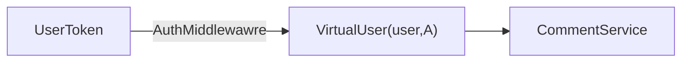
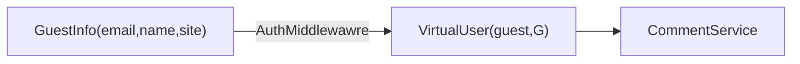
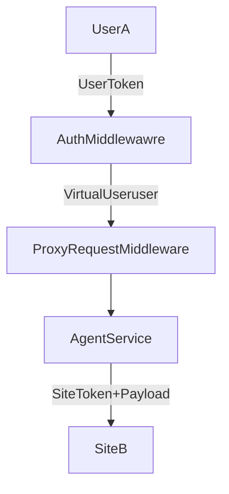

# 代理

从本地站点角度来看，代理（Agent）是指一个代表用户、访客或站点在另一个站点上执行操作的实体。

而在远程站点上，代理是指一个代表本地站点的虚拟用户（Virtual User）。

## 代理的类型

如下代码所示，代理的类型有三种：

- 访客（guest）：表示一个身份未经验证、也未在本地注册的用户。
  
  例如，一个访客在本地站点上发表了一条评论，这条评论将会被代理到远程站点上，而在远程站点上，这条评论将会被虚拟用户（Virtual User）代表的访客发表。访问发表评论时，会附带访客的信息，例如访客的名称、电子邮件和网站。但这些信息是未经验证故而不可信的，因此将会标记为访客。

- 用户（user）：表示一个身份已经验证、并且在本地注册的用户。

  例如，一个用户在本地站点上发表了一条评论，这条评论将会被代理到远程站点上，而在远程站点上，这条评论将会被虚拟用户（Virtual User）代表的用户发表。用户拥有比访客更多的信息和更高的可信度，用户的身份是收到本地站点承认的，而远程站点如果承认本地站点，则也承认了用户的身份。

- 系统（system）：表示一个站点。

  当一个请求代表本地站点，但不指代于具体的本地用户，则以系统的身份发出。系统的可信度和权限不低于用户。

```ts
export enum AgentType {
    guest = 'guest',
    user = 'user',
    system = 'system',
}

export type VirtualUserType = AgentType
```

## 虚拟用户

虚拟用户（Virtual User）是指在远程站点（Site B）上的用户，它一个代表本地或远程站点的用户、访客或站点在远程站点上执行操作的实体。

```ts
export interface VirtualUser {
    site: string
    uuid: string
    is_local: boolean
    type: keyof typeof VirtualUserType
    email: string
    username: string
    role: string
}
```

实际上虚拟用户的概念是代理概念的延伸，它是代理在远程站点上的具体表现，也是远程站点的用户、访客或站点在远程站点上执行操作的实体。

## 实例

当本站用户 UserA 在 SiteA 上发表对 PostA 的评论时，请求过程如下：



当匿名用户在 SiteA 上发表对 PostA 的评论时，由于匿名用户没有 Token，请求过程如下：



当本站用户 UserA 在 SiteA 上发表对远程文章 PostB 的评论时，请求过程如下：


