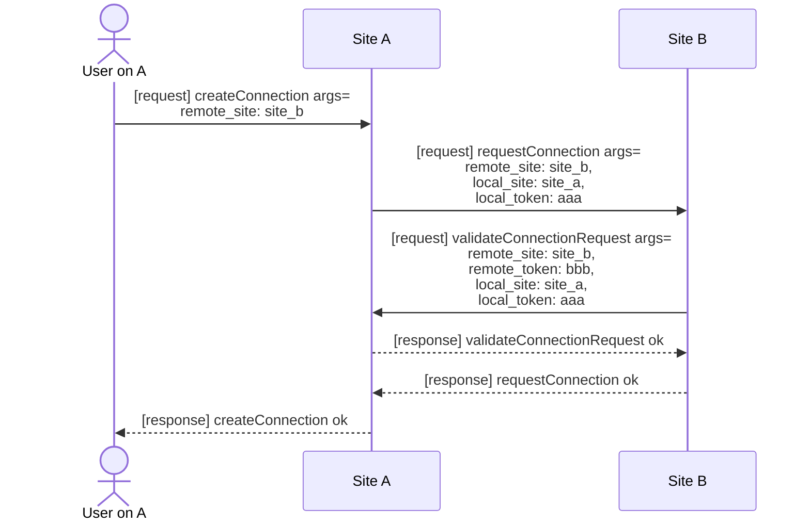

# 连接

连接是一个抽象概念，表示站点之间的边。一条连接将两个站点连接起来。连接可以是单向的，也可以是双向的。

连接服务（ConnectionService）负责在远程站点之间创建、管理和验证连接。

建立连接之后，站点之间可以通过连接附带的 JWT 令牌在有效期内进行受控且可信的通信。一旦过期，连接将自动断开。

## 连接的类型

- 出站连接（Outgoing）：从当前站点指向另一个站点的连接。
- 入站连接（Incoming）：从另一个站点指向当前站点的连接。
- 双向链接（Both）：连接既是出站连接，也是入站连接。

## 连接的建立

### 单向连接

下面的代码将创建一个出站连接，从当前站点指向另一个站点。

```ts
const request = rpc(siteUrl2)
const crRet = await request('connection', 'createConnection', {
    remote_site: siteName2
} as CreateConnectionDto)

assert.strictEqual(crRet.statusCode, 200, crRet.body)
```

一旦在当前站点创建了出站连接，远程站点的数据库会相应地创建一个入站连接。

### 双向连接

在本地站点执行上述代码后，再在远程站点执行如下代码：

```ts
const request = rpc(siteUrl1)
const crRet = await request('connection', 'createConnection', {
    remote_site: siteName1
} as CreateConnectionDto)

assert.strictEqual(crRet.statusCode, 200, crRet.body)
```

则从远程站点创建了一个到本地站点的出站连接，而由于已经存在从本地站点到远程站点的出站连接，因此此连接将在两个站点都被升级为双向连接。

### 原理

连接的创建可以分为三个步骤：

1. `createConnection` (Client->Local Site)
    - 客户端向本地站点发出创建连接的请求。参数为远程站点的名称。
2. `requestConnection` (Local Site->Remote Site)
    - 本地站点调用 `requestConnection` 向远程站点发出创建连接的请求。参数为本地站点的名称以及为远程站点创建的 JWT 令牌。
3. `validateConnectionRequest` (Remote Site->Local Site)
    - 远程站点表示收到令牌并同意创建连接，而为了验证此请求来自合法的本地站点，远程站点会调用 `validateConnectionRequest` 验证。参数为远程站点的名称以及为本地站点创建的 JWT 令牌。



### 详细过程

请查阅 ConnectionService 的源代码。
